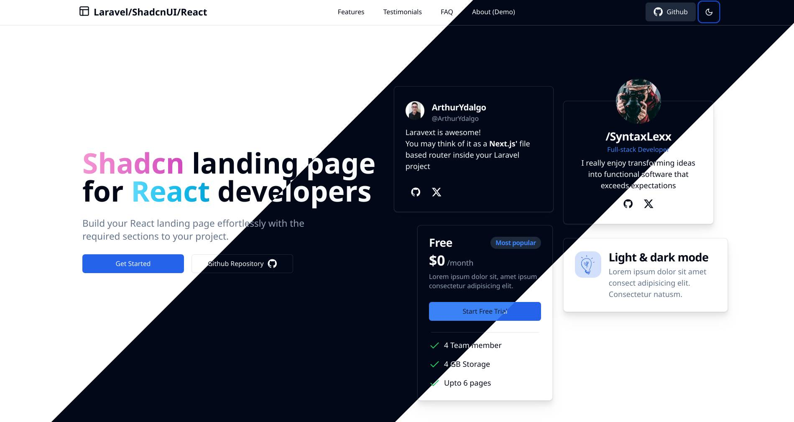

<p align="center"><a href="https://laravel.com" target="_blank"></a></p>

<p align="center">
<a href="https://github.com/syntaxlexx/laranext/actions"></a>
<a href="https://opensource.org/licenses/MIT"></a>
</p>



# Table of Contents
- [About LaraNext - The React+ShadCN-UI Starter Kit](#about-laranext---the-reactshadcn-ui-starter-kit)
- [About Laravel](#about-laravel)
- [Learning Laravel](#learning-laravel)
- [Getting Started](#getting-started)
  - [Prerequisites](#prerequisites)
  - [Installation](#installation)
  - [Running tests](#running-tests)
- [Contributing](#contributing)
- [Security Vulnerabilities](#security-vulnerabilities)
- [License](#license)


## About LaraNext - The React+ShadCN-UI Starter Kit
Laranext is a React+Shadcn starter kit for building Laravel applications. It merges the ideas portrayed in the [Laravel Inertia.js](https://github.com/inertiajs/inertia-next), [React Inertia](https://github.com/inertiajs/react-inertia), and [Nextjs](https://nextjs.org/) projects into a single starter kit. 

This kit is designed to be a lightweight and easy-to-use solution for building **beautiful**, modern, fast, **robust** and responsive web applications with Laravel and React.

>Want a vuejs version? We've got a [Kick-Starter Campaign over at Kofi](https://ko-fi.com/acelords) to help with a few development costs.

## About Laravel

Laravel is a web application framework with expressive, elegant syntax. We believe development must be an enjoyable and creative experience to be truly fulfilling. Laravel takes the pain out of development by easing common tasks used in many web projects, such as:

- [Simple, fast routing engine](https://laravel.com/docs/routing).
- [Powerful dependency injection container](https://laravel.com/docs/container).
- Multiple back-ends for [session](https://laravel.com/docs/session) and [cache](https://laravel.com/docs/cache) storage.
- Expressive, intuitive [database ORM](https://laravel.com/docs/eloquent).
- Database agnostic [schema migrations](https://laravel.com/docs/migrations).
- [Robust background job processing](https://laravel.com/docs/queues).
- [Real-time event broadcasting](https://laravel.com/docs/broadcasting).

Laravel is accessible, powerful, and provides tools required for large, robust applications.

## Learning Laravel

Laravel has the most extensive and thorough [documentation](https://laravel.com/docs) and video tutorial library of all modern web application frameworks, making it a breeze to get started with the framework.

You may also try the [Laravel Bootcamp](https://bootcamp.laravel.com), where you will be guided through building a modern Laravel application from scratch.

If you don't feel like reading, [Laracasts](https://laracasts.com) can help. Laracasts contains thousands of video tutorials on a range of topics including Laravel, modern PHP, unit testing, and JavaScript. Boost your skills by digging into our comprehensive video library.

## Getting Started

### Prerequisites

- PHP 8.3+
- Node.js 20+
- Composer 2
- Postgres

For testing purposes, you may also use sqlite. But we **highly** encourage Postgres.
> [Neon DB](https://neon.tech/) is a serverless platform designed to help you build reliable and scalable applications faster using Postgres.

### Installation
1. Clone the repository into your **Sites** directory 
  - (Hope you're using [Laravel Herd](https://herd.laravel.com/)  or [Laravel Valet](https://laravel.com/docs/11.x/valet) to serve your sites)
```bash
git clone https://github.com/syntaxlexx/laranext.git
```
2. Copy the `.env.example` file to `.env` and update the values accordingly.
```bash
cp .env.example .env
```
3. Install the dependencies (both for PHP and Node.js)
```bash
composer install
pnpm install
```
4. Migrate the database migrations
```bash
php artisan migrate
```
5. Seed the database
```bash
php artisan db:seed
```
6. Refresh IDE metadata files and generate typescript types
```bash
composer ide-helper
composer generate-types
```
7. Start the development server
```bash
npm run dev
```
8. Visit the application at [http://laranext.test](http://laranext.test)

### Running tests
The starter-kit uses **Pest** for testing.
```bash
php artisan test
```

## Contributing

Thank you for considering contributing to the Laranext Starter Kit! We welcome contributions from the community.

## Security Vulnerabilities

If you discover a security vulnerability within Laravel, please send an e-mail to SyntaxLexx via [syntaxlexx@gmail.com](mailto:syntaxlexx@gmail.com). All security vulnerabilities will be promptly addressed.

## License

- The Laravel framework is open-sourced software licensed under the [MIT license](https://opensource.org/licenses/MIT).

- The LaraNext Starter Kit is open-sourced software licensed under the [MIT license](https://opensource.org/licenses/MIT).
